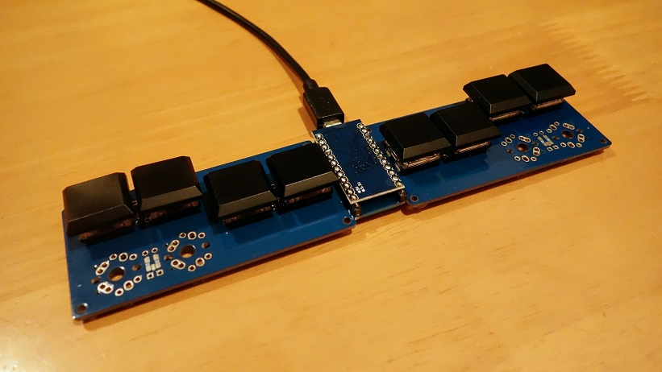

# braille_Keyboard

Braille Keyboard は、点字を入力できるキーボードです。

- [Key Layout](http://www.keyboard-layout-editor.com/##@@_a:7&f:5%3B&=S&=D&_x:2&g:true&w:1.25&h:2%3B&=&_x:2&g:false&f:5%3B&=K&=L%3B&@_y:-0.5&x:2&n:true%3B&=F&_c=%23bbbbbb&f:2%3B&=G&_x:1.25%3B&=H&_c=%23cccccc&f:5&n:true%3B&=J)
- [User Manual](doc/UserManual.md)
- [Build Guide](doc/BuildGuide.md)

- [firmware](firmware)
- [PCB](pcbdesign)

