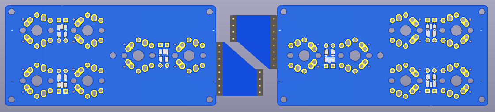
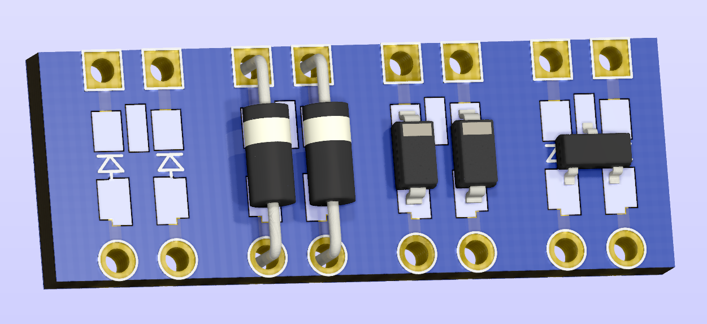
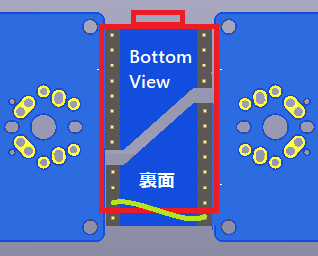

# Build guide

## 部品リスト

|品名|数量|入手先の例|
|----|----|-------|
|braille_keyboard 基板|2枚組| [お問い合わせください](mailto:matobaa+braillekb@gmail.com)
|キースイッチ (ALPSまたはMX互換またはChoc)|8個|[遊舎工房　10個セット 400円～](https://yushakobo.jp/product-category/switches/)
|キーキャップ|8個|[遊舎工房　10個セット 200円～](https://yushakobo.jp/product-category/keycaps/)
|カソードコモンSMDダイオード<br>(1素子SMD、挿入部品でも可)|4個<br>8個|[秋月電子 SMDダイオード 2素子入り 20個 100円](http://akizukidenshi.com/catalog/g/gI-14250/)<br>[秋月電子 SMDダイオード 40個 100円](http://akizukidenshi.com/catalog/g/gI-07084/))
|Pro Micro |1個| [スイッチサイエンス 1980円](https://www.switch-science.com/catalog/3914/)<br>[Aliexpress 400円くらい](https://ja.aliexpress.com/w/wholesale-pro-micro-atmega32u4.html) microUSBコネクタつき、5v品を
|(Pro Microに同梱されていなければ)<br>ピンヘッダ 2mm厚|12pin ×2|[秋月電子 ピンヘッダ 1x40 35円](http://akizukidenshi.com/catalog/g/gC-00167/) 
|||||

## 組み立て手順

### 基板の位置関係の確認

<a href="pcb_position.png"></a>

組み立ての前に、基板の表裏と位置関係を確認します。基板は横長で、左側は台形のベロが中央下にくるように、右側は台形のベロが中央上になるように配置してください。中央部分には、縦方向にProMicroが置かれます。

(試作基板 rev.0 は中央に100milの隙間を開けてください)

### ファームウェアの準備

デフォルトのファームウェアである [braille_default.hex](../../../releases/) が配布されています。ビルド環境をつくるのが難しい方はこちらを利用してください。

ソースから作成する場合、Linux環境がおすすめです。Windows環境の方は [Gooble Cloud Shell](https://ssh.cloud.google.com/) などを利用するとお手軽です。

1. ソースとサブモジュールを clone します。
    ```
    $ git clone https://github.com/matobaa/braille_keyboard.git  --recursive
    $ cd braille_keyboard/firmware/
    ```
1. クロスコンパイル環境を整えます (すこし時間がかかります)。
    ```
    $ ./qmk_firmware/util/qmk_install.sh
    ```
1. make します。
    ```
    $ make
    $ ls -l braille_default.hex
    ```

### Pro Micro の準備

組み立ての前に、Pro Microにファームウェアを書き込んで動作確認をしてください。詳細な手順についてはサリチル酸さんのサイトを参考にしてください。

- [（初心者編）自作キーボードにファームウェアを書き込む](https://salicylic-acid3.hatenablog.com/entry/qmk-toolbox)

<a href="diodepad.png"></a>

### ダイオードのはんだ付け

基板の8カ所にダイオードをはんだ付けします。

ダイオードには向きがあります。部品に線が引いてある側を、四角い方の穴にさして半田付けします。表面実装部品の場合は、線が引いてある側を、四角い穴に近いパッドに半田付けします。

片側の片面に6ヶ所ずつ、表裏左右で合計24ヶ所ありますが、はんだ付けするのは、外側奥と中央付近、左右合計で8ヶ所だけです。表裏で同じ位置のものは表か裏かのどちらかだけをはんだ付けします。外側手前は使いません。

隣り合っている2ヶ所は、BAV70系列のカソードコモン表面実装部品を使えば1つでまかなえます。図右端のように、下の左右のパッドに2本の足が、上の中央のパッドに1本の足がくるように置いてはんだ付けします。上の3つのパッドはつながってしまっても問題ありません。

### ピンヘッダ、ProMicroのはんだ付け

中央部分にProMicroをはんだ付けします。表側に出るピンヘッダは、はんだ付け前に短く切っておくと仕上がりがキレイになります。
ピンヘッダを2列はんだ付けし、ProMicroをはんだ付けします。ProMicroは表側に、部品面が内側、USBコネクタが奥になる向きになるよう組み立てます。はんだ付けしたら、表側のピンは短く切っておきましょう。

<a href="pcb_patch_for_rev0.png"></a>
試作基板 rev.0 は設計ミスがあるため、100mil(1ピン分)だけすき間をあけて組み立てます。ProMicroは奥に寄せ、手前側のランドを1つ余らせます。未接続になってしまう左手側(裏面から見て右側)の余りランドを、右手側の一番下のピン(=下から二番目のランド)にジャンパワイヤで結線します。

### スイッチのはんだ付け

外側奥の2ヶ所ずつ、中央寄り2ヶ所ずつ、左右合計8ヶ所にスイッチをはんだ付けします。表からとりつけ、裏からはんだ付けします。
手前側2ヶ所ずつは開けておいてかまいません。つけても問題はありません。

キャップをはめたらできあがりです。

必要に応じ、3ミリ高程度のゴム足を貼り付けてください。

組み立ての手順は以上です。