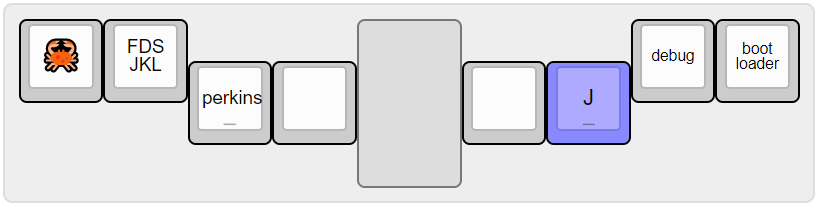

# Braille Keyboard 使い方

## モード

以下の3つのモードがあります。未設定時はFDSJKLモードです。

321456モード、123654モードの場合、[WinCompose](https://github.com/samhocevar/wincompose)と併用することで、6点点字を直接入力できます。

1. FDSJKLモード
2. 321456モード (パーキンスブレーラー/アポロブレーラーモード; 左端から3-2-1--4-5-6)
3. 123654モード (ライトブレーラー/カニタイプモード; 左端から1-2-3--6-5-4)

## 動作

説明上、左から「S」「D」「F」「G」、「H」「J」「K」「L」キーと呼びます。

### F,D,S,J,K,L キー

FDSJKLモードのときは、それぞれ F, D, S, J, K, L という文字が入力されます。

321456モード、123654モードのときは、一度に押すことでUnicode点字が入力されます。

### Gキー

スペースが入力されます。

### Hキー

バックスペースが入力されます。

Hキーを押しながらGキーを押すことで、改行が入力されます。

## Gキーとの組み合わせ

Gキーを押しながら別のキーを押すことで、カーソルを移動できます。

- G+H: カーソルを左に移動します。
- G+J: カーソルを下に移動します。
- G+K: カーソルを上に移動します。
- G+L: カーソルを右に移動します。
- G+S: カーソルを行頭に移動します。
- G+D: カーソルを行末に移動します。
- G+F: シフトキーを押し下げます。そのままHJKLSDを押すことで範囲選択できます。

## Hキーとの組み合わせ

Hキーを押しながら別のキーを押すことで、クリップボードを操作できます。

- H+S: Ctrl-Z が入力されます。 (元に戻す)
- H+D: Ctrl-X が入力されます。 (切り取り)
- H+F: Ctrl-C が入力されます。 (コピー)
- H+G: 改行します。
- H+J: Ctrl-Y が入力されます。 (繰り返し)
- H+K: Ctrl-V が入力されます。 (貼り付け)
- H+L: 改行します。 

## モード設定

下記のキーの組合せを押しながらキーボードをPCに接続することで、動作モードを変更できます。設定したモードはキーボード本体に記憶されます。

- J+D: モードをFDSJKLモードにします。
- J+F: モードを321456モード(バーキンスモード)にします。
- J+S: モードを123654モード(カニタイプモード)にします。
- J+L: 別のプログラムを書き込むためのブートローダーモードとなります。キーボードとしては使えません。

